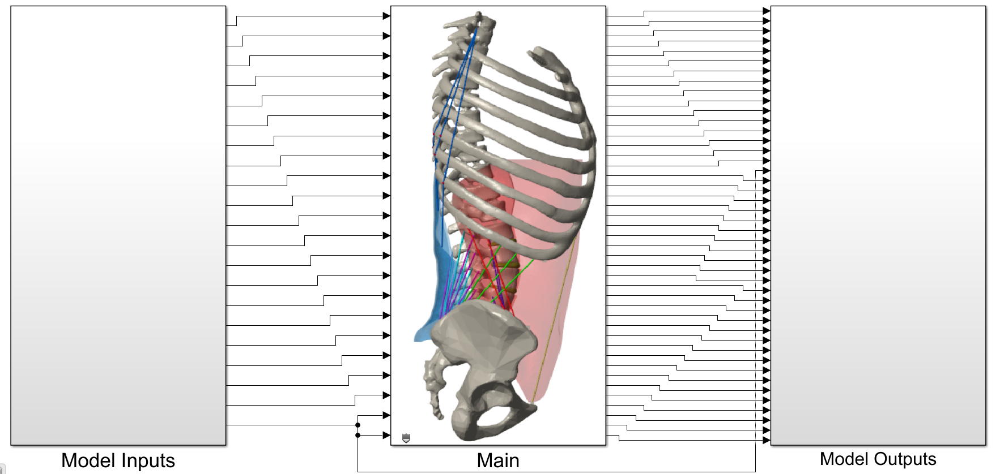

# ROMmodel-io
Repository containing the Rigid-Flexible Body Dynamic MATLAB model of the spine, referenced in Dukkipati & Driscoll 2025

## Project Overview
This repository provides MATLAB/Simulink models for rigid-flexible body dynamics (RFBD) of the human spine, including case-wise models (C0–C5) and benchmarking scripts. The model is referenced in

S.T. Dukkipati and M. Driscoll, "An Integrated Rigid-Flexible Body Dynamic Approach to Computationally Efficient Musculoskeletal Modeling and Muscle Recruitment Simulation of the Spine and Torso." Preprint. DOI: [10.13140/RG.2.2.13363.95529](https://doi.org/10.13140/RG.2.2.13363.95529)

### Main Files
- `ROMmodel_C0_C3.slx`, `ROMmodel_C1.slx`, `ROMmodel_C2.slx`, `ROMmodel_C4_C5.slx`: Simulink models for different spinal cases.
- `Main_C0_C3.slxp`, etc.: Protected Simulink model files.
- `Benchmarking/`: Contains scripts to benchmark each model (e.g., `b_C0.m`, `b_C1.m`, ...).
- `README.md`: Project documentation.
- `LICENSE`: MIT License.
- `schematic.png`: Model schematic (clickable for video).
- `ROMvideo.mp4`: Demonstration video.

## Simulink Model Structure
- **Model Workspace**: All tunable parameters are listed here. Some parameters are fixed and referenced directly in Simulink blocks.
- **Inputs**: Muscle forces, moments, and other biomechanical parameters. See the Appendix for parameter descriptions.
- **Model_Outputs Subsystem**: All outputs are available here. Use Simulink scopes or "To Workspace" blocks to view/export results.

## Case-wise Models
- The repository provides separate models for different spinal cases (C0–C5).
- Each case has a corresponding benchmarking script in the `Benchmarking/` folder.

## Running the Model
1. Open MATLAB and navigate to the `ROMmodel-io` directory.
2. Open the desired Simulink model (e.g., `ROMmodel_C0_C3.slx`).
3. Adjust input parameters in the Model Workspace as needed.
4. Run the simulation.
5. View outputs in the `Model_Outputs` subsystem.

## Benchmarking Scripts
- Scripts like `b_C0.m`, `b_C1.m`, etc., benchmark compile and run times for each case.
- Run `benchmarking_all.m` to benchmark all cases sequentially.
- Edit `numRuns` in each script to set the number of repetitions.
- Results are printed in the MATLAB command window.

## Model Inputs
- To change model inputs, go to Modeling tab → Design → Model Workspace.
- Some parameters are fixed; refer to the Appendix for details.

## Model Outputs
- All outputs are available in the `Model_Outputs` subsystem.
- Use Simulink scopes or "To Workspace" blocks to view/export data.

## Video Demonstration
- Click the schematic image above or watch the [demonstration video](https://youtu.be/evWWcnVyu3s).

## License
[![CC BY-NC-SA 4.0][cc-by-nc-sa-shield]][cc-by-nc-sa]

This work is licensed under a
[Creative Commons Attribution-NonCommercial-ShareAlike 4.0 International License][cc-by-nc-sa].

[![CC BY-NC-SA 4.0][cc-by-nc-sa-image]][cc-by-nc-sa]

[cc-by-nc-sa]: http://creativecommons.org/licenses/by-nc-sa/4.0/
[cc-by-nc-sa-image]: https://licensebuttons.net/l/by-nc-sa/4.0/88x31.png
[cc-by-nc-sa-shield]: https://img.shields.io/badge/License-CC%20BY--NC--SA%204.0-lightgrey.svg

## Contact
For questions or editable model files, contact the authors directly.
- Siril Teja Dukkipati: siril.dukkipati@mail.mcgill.ca
- Mark Driscoll: mark.driscoll@mcgill.ca
